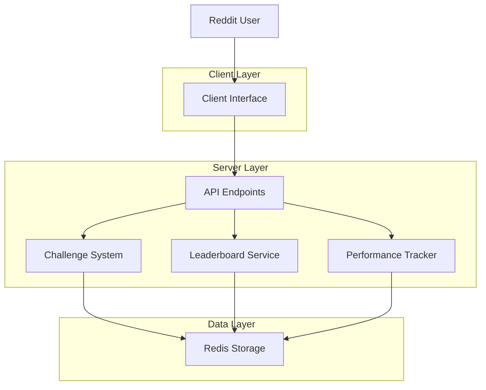
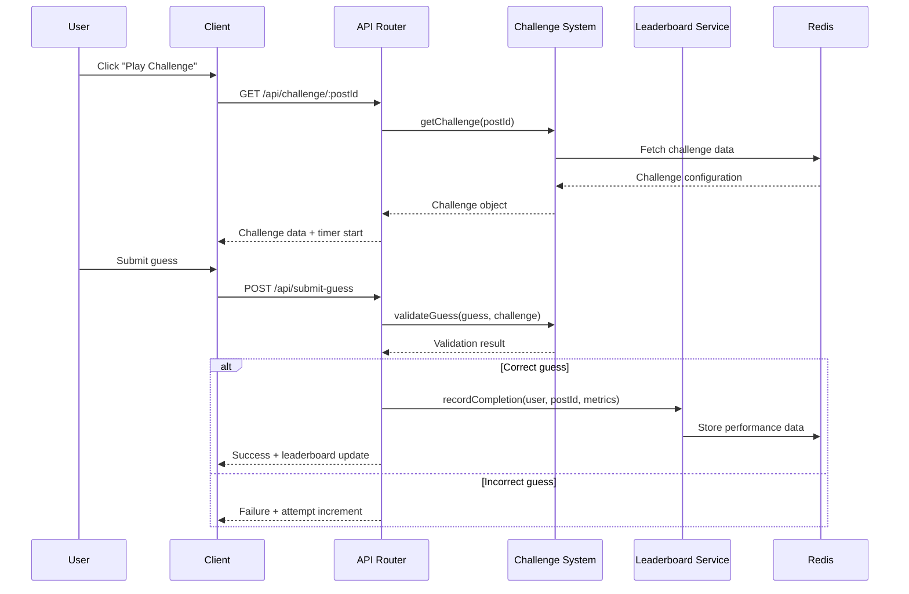

# Design Document

## Overview

The challenge integration system extends the existing Devvit Reddit game to provide a complete challenge-based gameplay experience. The design builds upon the existing challenge.ts core functionality and integrates it with proper API endpoints, client-side interactions, performance tracking, and leaderboard systems.

## Architecture

### High-Level Architecture



### Component Interaction Flow



## Components and Interfaces

### 1. API Router Extensions

**Location**: `src/server/index.ts`

**New Endpoints**:
- `GET /api/challenge/:postId` - Retrieve challenge data
- `POST /api/submit-guess` - Submit and validate user guess
- `GET /api/leaderboard/:postId` - Get leaderboard for specific challenge
- `POST /api/start-session` - Initialize user session with timer

**Interface Contracts**:
```typescript
// Challenge retrieval
GET /api/challenge/:postId
Response: {
  challenge: Challenge;
  userSession?: UserSession;
}

// Guess submission
POST /api/submit-guess
Body: {
  postId: string;
  guess: string;
  sessionId: string;
}
Response: {
  correct: boolean;
  attempts: number;
  timeElapsed?: number;
  leaderboardPosition?: number;
}

// Leaderboard retrieval
GET /api/leaderboard/:postId
Response: {
  leaderboard: LeaderboardEntry[];
  userRank?: number;
}
```

### 2. Enhanced Challenge System

**Location**: `src/server/core/challenge.ts`

**New Methods**:
- `createDefaultChallenge(postId: string)` - Create hardcoded default challenge
- `validateGuess(guess: string, challenge: Challenge)` - Validate user input
- `getUserSession(username: string, postId: string)` - Get/create user session

**Default Challenge Configuration**:
```typescript
const DEFAULT_CHALLENGE: Omit<Challenge, 'id' | 'createdAt' | 'postId'> = {
  shapes: [
    { shape: 'circle', xPercent: 30, yPercent: 40, sizePercent: 15, rotation: 0 },
    { shape: 'rectangle', xPercent: 50, yPercent: 60, sizePercent: 20, rotation: 45 },
    { shape: 'triangle', xPercent: 70, yPercent: 30, sizePercent: 12, rotation: 0 }
  ],
  answer: 'house',
  postTitle: 'Welcome to Shape Guess Challenge!',
  createdBy: 'system',
  subredditName: ''
};
```

### 3. Leaderboard Service

**Location**: `src/server/core/leaderboard.ts` (new file)

**Responsibilities**:
- Track user performance per challenge
- Maintain sorted rankings
- Handle ties and scoring logic

**Redis Schema**:
```
leaderboard:{subredditName}:{postId} -> Sorted Set
  Score: completion_time_ms + (attempts * 1000) // Lower is better
  Member: username

user_stats:{subredditName}:{postId}:{username} -> Hash
  attempts: number
  completion_time: number
  completed_at: timestamp
```

### 4. Performance Tracker

**Location**: `src/server/core/performance.ts` (new file)

**Responsibilities**:
- Track session timing
- Count attempts
- Store completion metrics

**Session Management**:
```typescript
interface UserSession {
  sessionId: string;
  username: string;
  postId: string;
  startTime: number;
  attempts: number;
  completed: boolean;
}
```

### 5. Client Interface Updates

**Location**: `src/client/` components

**New Components**:
- `ChallengeView.tsx` - Main challenge display and interaction
- `Timer.tsx` - Real-time timer display
- `AttemptCounter.tsx` - Attempt tracking display
- `Leaderboard.tsx` - Leaderboard display component

**State Management**:
```typescript
interface ChallengeState {
  challenge: Challenge | null;
  session: UserSession | null;
  timer: {
    startTime: number;
    elapsed: number;
    isRunning: boolean;
  };
  attempts: number;
  leaderboard: LeaderboardEntry[];
  gameStatus: 'loading' | 'playing' | 'completed' | 'error';
}
```

## Data Models

### Extended Types

**Location**: `src/shared/types/api.ts`

```typescript
export interface UserSession {
  sessionId: string;
  username: string;
  postId: string;
  startTime: number;
  attempts: number;
  completed: boolean;
}

export interface LeaderboardEntry {
  username: string;
  attempts: number;
  completionTime: number;
  completedAt: number;
  rank: number;
}

export interface ChallengeResponse {
  challenge: Challenge;
  session?: UserSession;
}

export interface GuessSubmissionRequest {
  postId: string;
  guess: string;
  sessionId: string;
}

export interface GuessSubmissionResponse {
  correct: boolean;
  attempts: number;
  timeElapsed?: number;
  leaderboardPosition?: number;
  message: string;
}

export interface LeaderboardResponse {
  leaderboard: LeaderboardEntry[];
  userRank?: number;
  totalPlayers: number;
}
```

## Error Handling

### Client-Side Error Handling

1. **Network Failures**: Retry mechanism with exponential backoff
2. **Invalid Responses**: Graceful degradation with user-friendly messages
3. **Session Timeouts**: Automatic session recovery
4. **Challenge Loading Failures**: Fallback to cached data or error state

### Server-Side Error Handling

1. **Redis Connection Issues**: Circuit breaker pattern with fallback responses
2. **Invalid Challenge Data**: Data validation and sanitization
3. **Authentication Failures**: Proper HTTP status codes and error messages
4. **Rate Limiting**: Request throttling for guess submissions

### Error Response Format

```typescript
interface ErrorResponse {
  status: 'error';
  message: string;
  code?: string;
  retryable?: boolean;
}
```

## Testing Strategy

### Unit Tests

**Challenge System Tests**:
- Default challenge creation
- Guess validation logic
- Session management
- Redis key generation

**Leaderboard Tests**:
- Ranking calculation
- Tie-breaking logic
- Performance metric storage
- Data retrieval accuracy

### Integration Tests

**API Endpoint Tests**:
- Challenge retrieval flow
- Guess submission workflow
- Leaderboard generation
- Error handling scenarios

**Redis Integration Tests**:
- Data persistence verification
- Concurrent access handling
- Performance under load
- Data consistency checks

### Client-Side Tests

**Component Tests**:
- Timer accuracy and display
- Attempt counter functionality
- Challenge rendering
- User interaction handling

**State Management Tests**:
- Session state transitions
- Error state handling
- Data synchronization
- Performance optimization

### End-to-End Tests

**User Journey Tests**:
- Complete challenge flow from start to finish
- Leaderboard updates after completion
- Multiple user concurrent gameplay
- App installation and default challenge creation

## Performance Considerations

### Redis Optimization

1. **Key Expiration**: Set TTL for session data to prevent memory bloat
2. **Batch Operations**: Use pipelines for multiple Redis operations
3. **Connection Pooling**: Efficient Redis connection management
4. **Data Compression**: Compress large challenge configurations

### Client Performance

1. **Lazy Loading**: Load leaderboard data on demand
2. **Debounced Updates**: Prevent excessive API calls during rapid interactions
3. **Caching Strategy**: Cache challenge data locally during gameplay
4. **Progressive Enhancement**: Core functionality works without JavaScript

### Scalability Considerations

1. **Horizontal Scaling**: Stateless server design for multiple instances
2. **Rate Limiting**: Prevent abuse of guess submission endpoints
3. **Memory Management**: Efficient session cleanup and garbage collection
4. **Monitoring**: Performance metrics and alerting for production issues
